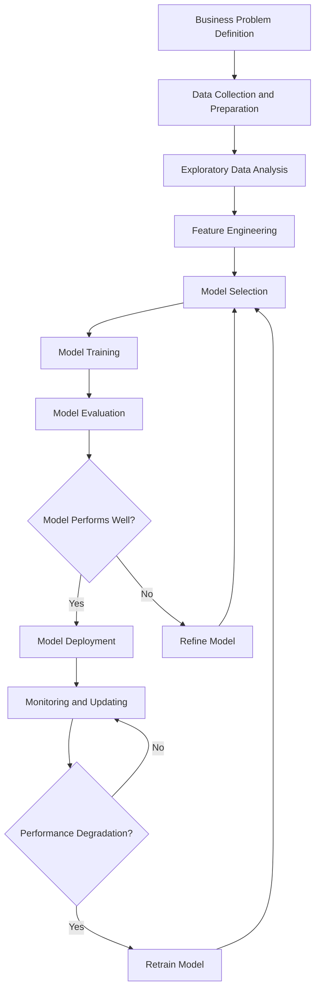

# Comprehensive Overview of AI, ML, and Data Modeling

## I. The AI and ML Landscape

<svg viewBox="0 0 400 300" xmlns="http://www.w3.org/2000/svg">
  

  <!-- AI circle -->
  <circle cx="200" cy="150" r="140" fill="#FFD700" opacity="0.5"/>
  <text x="70" y="70" class="heavy">Artificial Intelligence</text>
  <text x="90" y="90" class="small">Problem Solving</text>
  <text x="70" y="110" class="small">Knowledge Representation</text>
  
  <!-- ML circle -->
  <circle cx="160" cy="180" r="110" fill="#FF6347" opacity="0.5"/>
  <text x="60" y="220" class="heavy">Machine Learning</text>
  <text x="80" y="240" class="small">Statistical Techniques</text>
  <text x="60" y="260" class="small">Predictive Modeling</text>
  
  <!-- DL circle -->
  <circle cx="240" cy="180" r="80" fill="#4682B4" opacity="0.5"/>
  <text x="220" y="260" class="heavy">Deep Learning</text>
  <text x="230" y="280" class="small">Neural Networks</text>
</svg>

### 1. Artificial Intelligence (AI)
**Definition**: AI refers to the simulation of human intelligence in machines that are programmed to think and learn like humans. It encompasses a wide range of capabilities including problem-solving, reasoning, perception, and language understanding.

**Example**: An AI-powered virtual assistant like Siri or Alexa that can understand natural language queries, process them, and provide relevant responses or actions.

### 2. Machine Learning (ML)
**Definition**: ML is a subset of AI that focuses on the development of algorithms and statistical models that enable computer systems to improve their performance on a specific task through experience, without being explicitly programmed.

**Example**: A spam filter that learns to identify spam emails based on patterns in previously labeled spam and non-spam messages.

### 3. Deep Learning (DL)
**Definition**: DL is a subset of ML based on artificial neural networks with multiple layers. These deep neural networks can learn hierarchical representations of data, enabling them to process complex patterns in large datasets.

**Example**: A computer vision system that can recognize objects in images with high accuracy, such as those used in self-driving cars to identify pedestrians, traffic signs, and other vehicles.

### 4. Types of Machine Learning

a) **Supervised Learning**
   - Definition: The algorithm learns from labeled training data to make predictions or decisions.
   - Example: Predicting house prices based on features like size, location, and number of bedrooms.

b) **Unsupervised Learning**
   - Definition: The algorithm finds patterns or structures in unlabeled data.
   - Example: Customer segmentation in marketing, where customers are grouped based on purchasing behavior without predefined categories.

c) **Reinforcement Learning**
   - Definition: The algorithm learns to make decisions by interacting with an environment and receiving rewards or penalties.
   - Example: A game-playing AI that learns to play chess by competing against itself and improving its strategies based on win/loss outcomes.

## II. The Data Modeling Process

### 1. Problem Definition
**Definition**: The process of clearly articulating the business problem or question that needs to be addressed using data analysis or machine learning.

**Example**: An e-commerce company wants to reduce customer churn. The problem definition might be: "Predict which customers are likely to churn in the next 30 days based on their browsing and purchasing history."

### 2. Data Collection and Preparation
**Definition**: The process of gathering relevant data from various sources and cleaning it to ensure quality and consistency.

**Example**: For the churn prediction problem, this might involve collecting customer data (demographics, purchase history, website activity) from multiple databases, removing duplicates, handling missing values, and formatting dates consistently.

### 3. Exploratory Data Analysis (EDA)
**Definition**: The process of analyzing and visualizing the data to understand its characteristics, patterns, and relationships between variables.

**Example**: Creating histograms of customer purchase frequencies, scatter plots of age vs. total spend, or correlation matrices of all numerical variables to identify potential predictors of churn.

### 4. Feature Engineering
**Definition**: The process of creating new features or transforming existing ones to improve the performance of machine learning models.

**Example**: Creating a "days since last purchase" feature, binning continuous age data into categories, or encoding categorical variables like product categories into numerical formats.

### 5. Model Selection and Training
**Definition**: The process of choosing appropriate algorithms based on the problem type and data characteristics, and then training these models on the prepared data.

**Example**: For churn prediction, you might select algorithms like Logistic Regression, Random Forest, and Gradient Boosting. You would then train these models on a subset of your customer data, using features like purchase history, website activity, and engineered features.

### 6. Model Evaluation
**Definition**: The process of assessing the performance of trained models using various metrics and validation techniques.

**Example**: For the churn prediction model, you might use metrics like accuracy, precision, recall, and F1-score. You would also employ techniques like cross-validation to ensure the model's performance is consistent across different subsets of the data.

### 7. Model Deployment and Monitoring
**Definition**: The process of integrating the chosen model into production systems and continuously monitoring its performance over time.

**Example**: Deploying the churn prediction model as part of a customer relationship management (CRM) system, where it automatically flags high-risk customers for the retention team. Regularly checking the model's accuracy and retraining it as needed to account for changing customer behaviors.

## III. Advanced Statistical Concepts

### 1. Probability Distributions
**Definition**: Mathematical functions that describe the likelihood of different outcomes in a random experiment.

**Example**: The normal distribution is often used to model natural phenomena, like human heights or standardized test scores.

### 2. Hypothesis Testing
**Definition**: A statistical method for making decisions about population parameters based on sample data.

**Example**: A/B testing in web design, where you might test whether a new website layout (A) leads to a significantly higher conversion rate compared to the old layout (B).

### 3. Regression Analysis
**Definition**: A set of statistical methods for estimating the relationships between variables.

**Example**: Analyzing how factors like advertising spend, seasonality, and competitor pricing affect a company's sales.

### 4. Time Series Analysis
**Definition**: Statistical methods for analyzing time-ordered data to extract meaningful patterns and trends.

**Example**: Forecasting future sales based on historical sales data, accounting for factors like seasonality and long-term trends.

### 5. Dimensionality Reduction
**Definition**: Techniques for reducing the number of variables in a dataset while retaining most of the important information.

**Example**: Using Principal Component Analysis (PCA) to reduce the number of features in a large dataset of customer attributes, making it easier to visualize and model.

### 6. Case Study PPT
Retail CS WorkShop NS in Canva